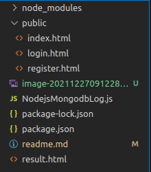

# 1.项目设计

## （1）项目整体构成

​	项目包括项目文件夹和一个readme文件构成。

​	项目文件夹中有一个js文件负责实现功能，剩下都是静态的网页。

## （2）引入的包在项目中的作用相关说明

​	express:静态网页的制作

​	mongoose:数据库的链接和使用

​	ejs:渲染字段

​	express-session:保留状态变量

## （3）项目目录结构和各个部分的说明

public文件夹下有三个网页的文件。

外部有readme.md文件，和一些截图图片。

外部还有一个NodejsMongodbLog.js的文件，包含了实现程序的代码

还有导入的包和相关文件。

# 2）使用说明书：

本项目是宠物店管理系统的简易实现。

用户分为管理员（店员），普通用户两种。

管理员由系统自定义插入，无法注册，拥有所有的权限。

普通用户可以通过网页进行注册，可以查询宠物状态，但是插入宠物信息必须要通过管理员（店员）来进行。

未登录无法进行任何操作。

注册时不能重复注册用户名，两次输入的密码必须一样，注册出的用户一定是普通用户，没有管理员权限。

在运行NodeMongodb

# 3）开发日记

2021/12/20：完成了数据库的写入和读取功能。

2021/12/25：完成了登录和注册的功能，并设置了注册的权限（密码需要输入两次一样的，且用户名不能重复）。

2021/12/26：引入了session组件，可以记录用户的登录状态

2021/12/27：利用session组件，实现了管理权限信息功能。

2021/12/28：项目结束，完成readme文件上传。